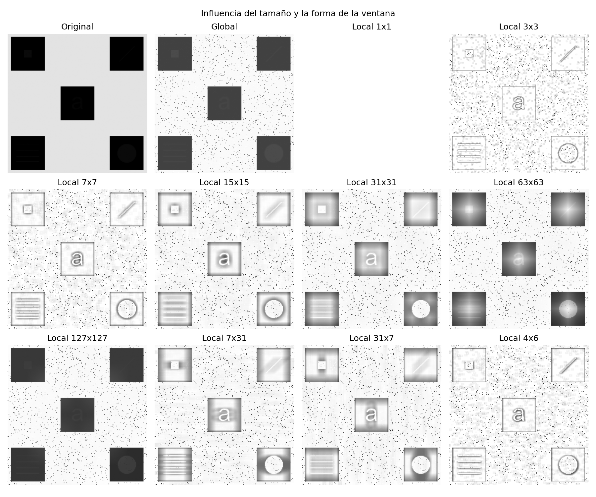
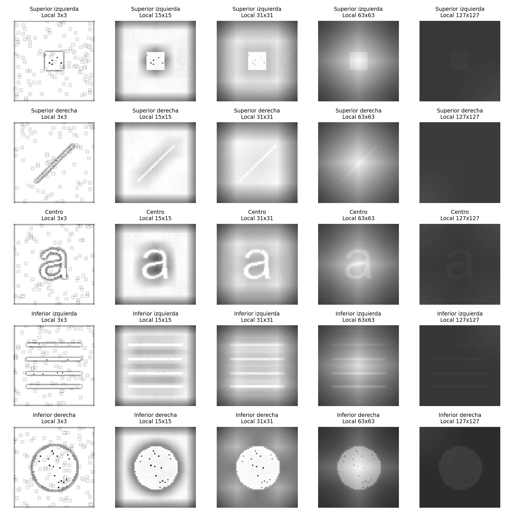
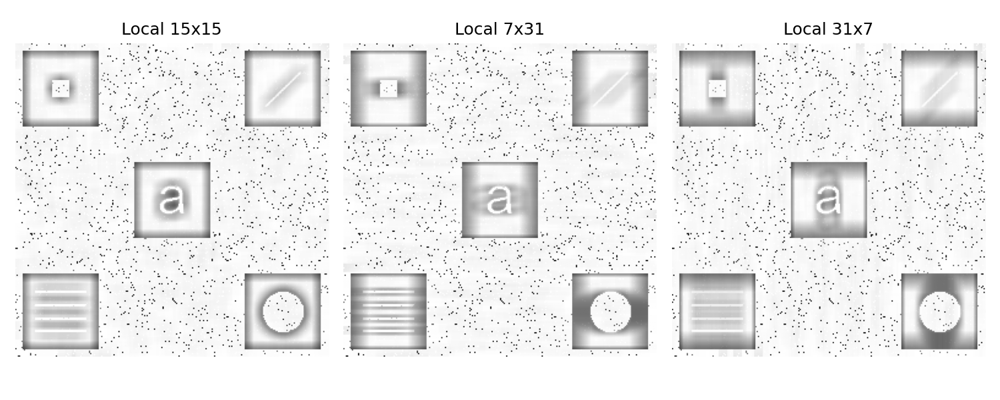

# Apartado c Influencia del tamaño de la ventana

Se procesó la misma imagen con diez ventanas, manteniendo la función del apartado a, el borde replicado y la visualización entre 0 y 255. Para esta imagen, **15 por 15 ofrece un resultado claro para reconocer los cinco detalles**; 31 por 31 también resulta útil. Esta conclusión surge de la inspección de los resultados, no de una regla que valga para cualquier imagen.

## Ventanas cuadradas

| Ventana | Observación en la imagen proporcionada |
| --- | --- |
| 1 por 1 | Toda la salida es blanca. La única intensidad de cada ventana acumula probabilidad 1. |
| 3 por 3 | Predominan los contornos y las pequeñas variaciones. El interior de las formas tiene poco contraste respecto de otras zonas blancas. |
| 7 por 7 | Los objetos se reconocen, pero todavía se resaltan muchos puntos y contornos. |
| 15 por 15 | Se ven claramente el cuadrado, la diagonal, la a, las cuatro líneas y el círculo; aparecen halos locales. |
| 31 por 31 | Las cinco formas siguen visibles; los cambios de brillo y halos abarcan zonas más amplias. |
| 63 por 63 | La diagonal y la a pierden contraste. El entorno empieza a incluir gran parte del fondo claro alrededor de los cuadrados oscuros. |
| 127 por 127 | Los detalles se ven débiles y la apariencia se aproxima a la referencia global; el círculo conserva más visibilidad. |



Las regiones oscuras miden aproximadamente 62 por 62 píxeles. Con ventanas pequeñas, el histograma suele depender de una porción del objeto y de su fondo oscuro. Al crecer la ventana, entran otras intensidades, incluido el fondo claro exterior, y cambia la probabilidad acumulada del píxel central. Esto explica la pérdida de contraste local en ventanas grandes, conforme al procedimiento y la motivación de la página 1 del enunciado.

Una ventana grande no es automáticamente igual a una ecualización global: sigue centrada en cada píxel y puede contener valores repetidos por el borde agregado. La semejanza observada con 127 por 127 es visual, no una igualdad de resultados.



## Ventanas rectangulares y pares

Las ventanas **7 por 31** y **31 por 7** contienen ambas 217 píxeles, pero incluyen vecinos diferentes. En 7 por 31 el entorno es ancho y bajo; en 31 por 7 es alto y angosto. Se observan halos alargados en distintas direcciones y diferencias alrededor de las líneas horizontales y de la letra a. Las cinco formas se conservan, pero la imagen resultante no depende solamente del área de la ventana.



Se incluyó también **4 por 6**, usando el anclaje `(2, 3)` definido en el apartado a. Su resultado muestra una respuesta de ventana pequeña, con contornos y variaciones muy visibles. Las ventanas impares tienen la ventaja de contar con un centro único y simétrico.

## Tiempo de cálculo

Los tiempos de esta ejecución con Python 3.12 están en [tiempos.csv](../resultados/c/tiempos.csv). Miden solamente la función, sin guardar imágenes ni preparar figuras.

| Ventana | Segundos |
| --- | ---: |
| 1 por 1 | 3,22 |
| 3 por 3 | 3,02 |
| 7 por 7 | 2,94 |
| 15 por 15 | 4,12 |
| 31 por 31 | 7,36 |
| 63 por 63 | 8,82 |
| 127 por 127 | 16,38 |
| 7 por 31 | 5,60 |
| 31 por 7 | 4,84 |
| 4 por 6 | 4,14 |

Son mediciones de una sola ejecución y varían con el equipo y su carga. El tiempo no crece de manera estricta en todas las filas, porque también intervienen el costo fijo del histograma y las variaciones de ejecución. La ventana más grande sí exige procesar más datos en cada posición y tarda bastante más que las chicas.

## Repetir la comparación

```powershell
.\.venv\Scripts\python.exe comparar_ventanas.py
```

El script guarda las diez imágenes `local_MxN.png`, tres figuras comparativas y el CSV en `resultados/c`. Para esta imagen se elige 15 por 15 como compromiso entre visibilidad de las formas, alcance de los halos y tiempo de cálculo. La ecualización también amplifica pequeñas variaciones, por lo que una mayor respuesta visual no significa necesariamente una mejor imagen en todos los aspectos.

La interpretación utiliza el histograma normalizado y la transformación acumulada de la Unidad 2, páginas 8 a 15, y la ventana móvil del enunciado. Las figuras utilizan lectura, recortes y visualización de la Unidad 1. Véase el [mapa de referencias](referencias.md).
